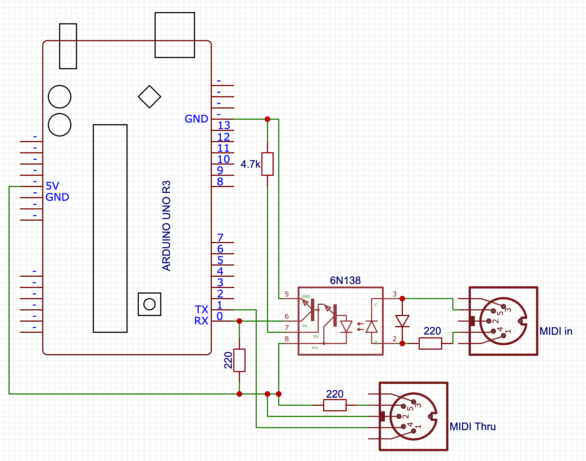
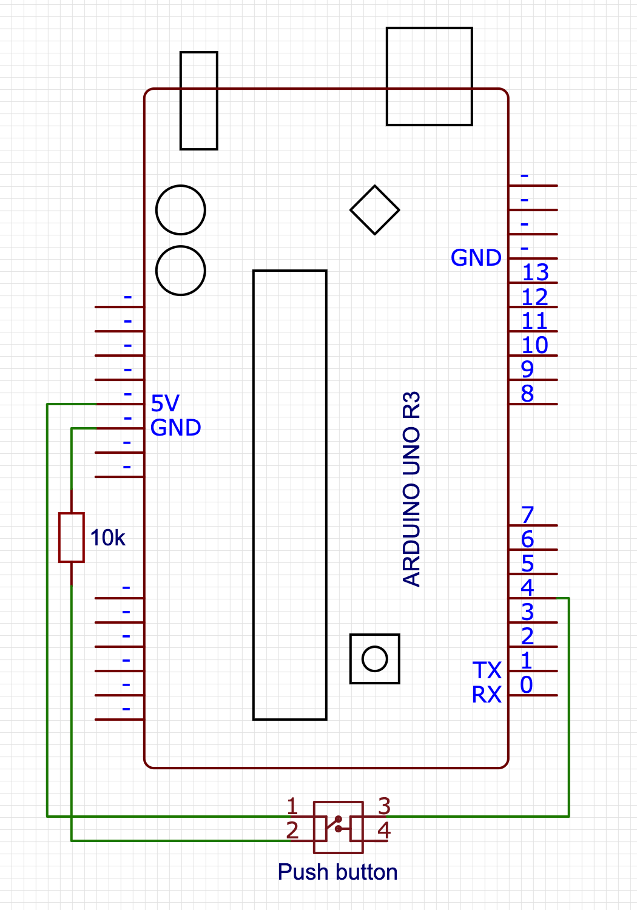

# Creating a MIDI pass-through recorder

If you've ever used audio softare on the computer, you probably know that MIDI exists: a signalling protocol that allows controllers to control vitual instruments like synths. It's also the protocol used by real audio hardware to talk to each, and you can think of it as the language in which devices talk about what they're doing, rather than what audio they're generating.

As such, there are two ways to record instruments (real or virtual): record the sound they're making, or record the MIDI event that cause that sound to be made, and that's where things get interesting. 

There are many, _many_ ways to record audio, from microphones to line monitors to audio interfaces, but not all that many ways to record MIDI events. Essentially: unless you're running software that monitors MIDI events, there isn't really any way to record MIDI. So I set out to change that: in the same way that you can just hook up an audio field recorder (like a Tuscan DR-05) to sit between an audio-out on something that generates audio and an audio-in on something that should be listening to that audio, writing that to an SD card as `.wav` or `.mp3` or the like,  I built a MIDI "field recorder" that you plug in between your MIDI-out and some MIDI-in, indiscriminately recording every MIDI event that gets sent over the wire to an SD card as a `.mid` file.

You'd think this would be something that already exists as a product you can just buy. Amazingly, it is not. So if you want one too, you'll have to build one, and if you want to build one, this post might be useful to you!

## Table of contents

1. [The circuitry](#the-circuitry)
   1. [MIDI](#the-midi-part-of-our-recorder)
   1. [SD card](#the-sd-part-of-our-recorder)
   1. [All the beeps](#adding-a-beep-for-debugging)
1. [The software](#the-software)
   1. [Basics](#program-basics)
   1. [MIDI handling](#midi-handling)
   1. [File management](#file-management)
   1. [Making some beeps](#making-some-beeps)
   1. [idle handling](#autorestart)
1. [Comments/questions](#comments-and-or-questions)

## The circuitry

To build this, we're going to basically build a standard Arduino based MIDI pass-through, with an SD card circuit hooked up so we can save the data that comes flying by. To build everything, we'll need some special components:

1. An Arduino SD card module (~$10 for a pack of five)
1. Two female 5-pin DIN connectors (~$5 for a pack of ten)
1. A 6N138 optocoupler (~$10 for a pack of ten)

And of course, the bits that you'll get with pretty much any Arduino starter kit:

1. An Arduino UNO R3 or equivalent board
1. 3x 220 ohm resistors
1. 1x 4.7k ohm resistor
1. A diode
1. A piezo buzzer
1. A clicky pushy button

### The MIDI part of our recorder

We set up MIDI-In on the Arduino `RX<-0` pin, with MIDI-Thru via the `TX->1` pin. The only tricky bit about this is that MIDI signals are isolated from the rest of the circuitry via an optocoupler (which gets around ground loop problems by literally transmitting signals by running them through a LED, which emits the signal as light, which then gets picked up by another LED and turned back into signal).



### The SD part of our recorder

The SD card circuitry is literally just a matter of "connect the pins to the pins", with the only oddity being that the pins don't _quite_ line up well enough to literally just stick the SD card module directly into the Arduino.

However, note that your SD card module **may have a different pin layout** so be sure to double-check before wiring things up!


### Adding a beep, for debugging

Also, we're going to add a little piezo speaker and a button that we can press to turn on (or off) playing a note corresponding to a MIDI note getting played, mostly as the audio equivalent of visual debugging. There's barely any work here: we hook up the "speaker" between pin 8 and ground, and the button to pin 2. Beep, beep!



## The Software

With the circuitry set up, let's start writing our program, focussing on dealing with each circuit in its own section

1. program basics
1. basic signal handling (MIDI library)
1. basic file writing (SD library)
1. Audio debugging (beep beep)
1. Usability bonus: "clean restart" on idle

### Program basics

Our basic program will need to import the standard [SD](https://www.arduino.cc/en/reference/SD) library, as well as the [MIDI](https://github.com/FortySevenEffects/arduino_midi_library) library (which you'll probably need to [install first](https://github.com/FortySevenEffects/arduino_midi_library#getting-started)).

Note that if you don't want to "follow along" and instead you just want the code, you can copy-paste the code found over in [midi-recorder.ino](https://raw.githubusercontent.com/Pomax/arduino-midi-recorder/master/midi-recorder.ino) into the Arduino IDE.

```c++
#include <SD.h>
#include <MIDI.h>

MIDI_CREATE_DEFAULT_INSTANCE();

/**
   Set up our MIDI field recorder
*/
void setup() {
  // we'll put some more code here in the next sections
}

/**
   The "game loop" consists of checking whether we need to
   perform any file management, and then checking for MIDI input.
*/
void loop() {
  // we'll put some more code here in the next sections
}
```

And we're done!

Of course this doesn't _do_ anything yet, so let's add the rest of the code, too.

### MIDI handling

For our MIDI handling, we'll need to set up listeners for MIDI events, and make sure to poll for that data during the program loop:

```c++
void setup() {
  MIDI.begin(MIDI_CHANNEL_OMNI);
  MIDI.setHandleNoteOn(handleNoteOn);
  MIDI.setHandleNoteOff(handleNoteOff);
  MIDI.setHandlePitchBend(handlePitchBend);
  MIDI.setHandleControlChange(handleControlChange);
}

void loop() {
  MIDI.read();
}
```

This sets up MIDI listening on all MIDI channels (there are sixteen of them, and we don't want to guess which channels are active), and reads out the MIDI data from `RX<-0` - you may have noticed we don't explicitly set a baud rate: the MIDI spec only allows for 31,250 bits per second, so the Arduino MIDI library automatically makes sure to set the correct polling rate for us.

That leaves implementing our MIDI event handling:

```c++
#define NOTE_OFF_EVENT 0x80
#define NOTE_ON_EVENT 0x90
#define CONTROL_CHANGE_EVENT 0xB0
#define PITCH_BEND_EVENT 0xE0

void handleNoteOff(byte CHANNEL, byte pitch, byte velocity) {
  byte event_type_on_channel = NOTE_OFF_EVENT | CHANNEL;
  write_to_file(event_type_on_channel, pitch, velocity);
}

void handleNoteOn(byte CHANNEL, byte pitch, byte velocity) {
  byte event_type_on_channel = NOTE_ON_EVENT | CHANNEL;
  write_to_file(event_type_on_channel, pitch, velocity);
}

void handleControlChange(byte CHANNEL, byte controller, byte value) {
  byte event_type_on_channel = CONTROL_CHANGE_EVENT | CHANNEL;
  write_to_file(event_type_on_channel, controller, value);
}

void handlePitchBend(byte CHANNEL, int bend_value) {
  byte event_type_on_channel = PITCH_BEND_EVENT | CHANNEL;
  
  // Per the MIDI spec, bend_value is 14 bits, and needs
  // to be encoded as two 7-bit bytes, encoded as the
  // lowest 7 bits in the first byte, and the highest 7
  // bits in the second byte:
  byte low_7_bits = (byte) (bend_value & 0x7F);
  byte high_7_bits = (byte) ((bend_value >> 7) & 0x7F);

  write_to_file(event_type_on_channel, low_7_bits, high_7_bits);
}
```

This is a good start, but MIDI events are just that: events, and events happen "at some specific time" which we're still going to have to capture. MIDI events don't rely on absolute time based on some kind of real time clock (which is good for us, because Arduino doesn't have an RTC built in!) and instead relies on counting a "time delta": it marks events with the number of "MIDI clock ticks" since the previous event, with the very first event in the event stream having an explicit time delta of zero.

So: let's write a `get_time_delta()` function that we can use to get the number of MIDI ticks since the last event (=since the last time `get_time_delta()` got called) so that we have all the data we need ready to start writing MIDI to file:

```c++
unsigned long start_time = 0;
unsigned long last_time = 0;
unsigned int time_delta = 0;

int get_time_delta() {
  if (start_time == 0) {
    start_time = micros();
    last_time = start_time;
    return 0;
  }
  time_delta = (micros() - last_time) / 100;
  last_time += time_delta ;
  return delta;
}
```

This function seems bigger than it has to be: we _could_ just start the clock when our sketch starts, setting `last_time=micros()` in `setup()`, and then in `get_time_delta` only have the `time_delta` calculation and `last_time` update, but that would be explicitly encoding "a lot of nothing" at the start of our MIDI file: we'd be counting the ticks for the first event relative to starting the program, rather than treating the first event as starting at tick zero. So instead, we explicitly encode the time that the first event happens as `start_time` and then we start delta calculation relative to that, instead.

You may also have noticed that we're (a) using `micros()` instead of the more common `millis()`, and (b) we're not even using that value directly, we're scaling it so that our ticks are 1/10,000th of a second instead. The reason here is that the MIDI spec links "the number of ticks per quaver/quarter note" and "the time it takes to play a quaver/quarter note" based on microseconds: in our case, we'll be defining a quaver/quarter note as taking 390,000μs, spanning an interval of 4000 ticks. So, in order to make sure there's we're using the correct scale for the number of ticks, we'll need to divide `micros()` by 100.

That then leaves updating our handlers:

```c++
void handleNoteOn(byte CHANNEL, byte pitch, byte velocity) {
  ...
  write_to_file(..., get_time_delta());
}

void handleNoteOff(byte CHANNEL, byte pitch, byte velocity) {
  ...
  write_to_file(..., get_time_delta());
}

void handleControlChange(byte CHANNEL, byte controller_code, byte value) {
  ...
  write_to_file(..., get_time_delta());
}

void handlePitchBend(byte CHANNEL, int bend_value) {
  ...
  write_to_file(..., get_time_delta());
}
```

Which means we can move on to actually writing MIDI data to a `.mid` file!

### File management

...

### Making some beeps

...

### Autorestart

...

# Comments and/or questions

Hit up https://github.com/Pomax/arduino-midi-recorder/issues if you want to have a detailed conversation, or just tweet/toot at me on https://twitter.com/TheRealPomax or https://mastodon.social/@TheRealPomax if you want the kind of momentary engagement the internet seems to be for these days =)

- Pomax
