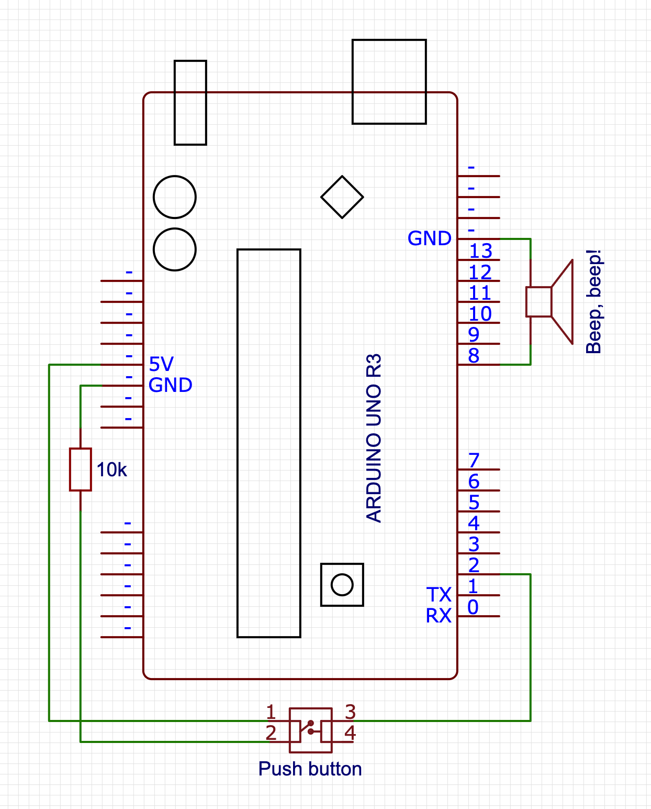

# Creating a MIDI pass-through recorder

If you've ever used audio software on the computer, you probably know that MIDI exists: a signalling protocol that allows controllers to control virtual instruments like synths. It's also the protocol used by real audio hardware to talk to each, and you can think of it as the language in which, rathar than communicating a fluctuating voltage signal or series of discrete sample values, devices talk about what is being done on them ("A4 got pressed", "F4 got released",  "the mod wheel moved down", etc).

As such, there are two ways to record digital instruments (real or virtual): you can record the sound they're making, or you can record the MIDI events that cause them to make those sounds, and that's where things get interesting.

There are many, _many_ ways to record audio, from microphones to line monitors to audio interfaces, on dedicated hardware, computers, phones, etc. etc., but there aren't all that many ways to record MIDI events. Essentially: unless you're running software that monitors MIDI events, there just isn't really any way to record MIDI. So I set out to change that: in the same way that you can just hook up an audio field recorder (like a Tascam DR-05) to sit between an audio-out on something that generates audio and an audio-in on something that should be listening to that audio, writing that to an SD card as `.wav` or `.mp3` or the like,  I built a MIDI "field recorder" that you plug in between your MIDI-out and some MIDI-in, indiscriminately recording every MIDI event that gets sent over the wire to an SD card as a `.mid` file.

You'd think this would be something that already exists as a product you can just buy (even if at probably quite the markup because it's made of "powder-coated extruded aluminium" with "audiophile quality" components, but still). Amazingly, it is not. There's just nothing.

So: if you want a MIDI recorder, you'll have to build one... and if you want to build one, this post might be useful to you!


## Table of contents

1. [The circuitry](#the-circuitry)
   1. [MIDI](#the-midi-part-of-our-recorder)
   1. [SD card](#the-sd-part-of-our-recorder)
   1. [MIDI marker button](#adding-a-midi-marker-button)
   1. [All the beep beeps](#adding-a-beep-for-debugging)
   1. [Optional: the real time clock](#bonus-adding-a-real-time-clock)
1. [The software](#the-software)
   1. [Basics](#program-basics)
   1. [MIDI handling](#midi-handling)
   1. [File management](#file-management)
   1. [Saving MIDI markers](#saving-midi-markers)
   1. [Making some beeps](#making-some-beeps)
   1. [idle handling](#creating-a-new-file-when-idling)
   1. [A final helper script](#a-final-helper-script)
1. [Importing MIDI data into your DAW](#importing-midi-data-into-your-daw)
1. [Comments/questions](#comments-and-or-questions)


## The circuitry

<a href="https://raw.githubusercontent.com/Pomax/arduino-midi-recorder/master/banner.jpg" target="_blank"></a>

To build this, we're going to basically build a standard "MIDI-In + MIDI-Thru" circuit using an Arduino, with an SD card module hooked up so we can save the data that comes flying by. To build everything, we'll need some special components:

1. An Arduino SD card module (~$10 for a pack of five)
1. Two female 5-pin DIN connectors (~$5 for a pack of ten)
1. A 6N138 optocoupler (~$10 for a pack of ten)
1. Optional: a DS3231-based RTC module

And of course, the bits that you'll get with pretty much any Arduino starter kit:

1. An Arduino UNO R3 or equivalent board
1. 2x 220 ohm resistors
1. 1x 4.7k ohm resistor
1. 2x 10k ohm resistors
1. A diode
1. A piezo buzzer
1. Two clicky pushy buttons


### The MIDI part of our recorder

We set up MIDI-In on the Arduino `RX<-0` pin, with MIDI-Thru tapping straight into signal that's getting sent to `RX<-0`, too. The only tricky bit about this is that MIDI signals are isolated from the rest of the circuitry via an optocoupler (which gets around ground loop problems by literally transmitting signals by running them through a LED, which emits the electrical signal as light, which then gets picked up by a phototransistor that turns the light back into an electrical signal). When placing and connecting the optocoupler, it is very important to make sure you know which pin is pin 1: it'll have a little mark next to it (typically a dot on the chip casing) to tell you that that side has pins 1 through 4 running top to bottom, and pins 5 through 8 on the other side _running bottom to top_. Also note that we're not using pins 1 and 4 for this circuit: only pins 2 and 3 are connected to the MIDI-In connector, and pins 5 through 8 are connected to the various arduino pins.

<a href="https://raw.githubusercontent.com/Pomax/arduino-midi-recorder/master/MIDI.png" target="_blank"></a>

(I know, "Thru isn't a word!", but that's what [the MIDI spec](http://www.shclemen.com/download/The%20Complete%20MIDI1.0%20Detailed%20Spec.pdf#page=7&zoom=auto,-206,478) calls it, so English gets to take a back seat here...)


### The SD part of our recorder

The SD card circuitry is literally just a matter of "connect the pins to the pins", with the only oddity being that the pins don't _quite_ line up well enough to literally just stick the SD card module directly into the Arduino.

However, note that your SD card module **may have a different pin layout** so be sure to double-check before wiring things up!

<a href="https://raw.githubusercontent.com/Pomax/arduino-midi-recorder/master/sd card.png" target="_blank"></a>

### Adding a MIDI marker button

In order to make it easier to find particularly "worth revisiting" parts of what got recorded, we add a button that connects to pin 4, that we can use to write MIDI markers into our file. There is barely anything to this circuit:

<a href="https://raw.githubusercontent.com/Pomax/arduino-midi-recorder/master/button.png" target="_blank"></a>


### Adding a beep, for debugging

And finally, we're going to add a little piezo speaker and a button that we can press to turn on (or off) playing a note corresponding to a MIDI note getting played, mostly as the audio equivalent of visual debugging. There's barely any work here: we hook up the "speaker" between pin 8 and ground, and the button to pin 2. Beep, beep!

<a href="https://raw.githubusercontent.com/Pomax/arduino-midi-recorder/master/beep.png" target="_blank"></a>


### Optional: adding a Real Time Clock

Our last bit of circuitry is not required in the slightest, but it does improve usability quite a bit: a real-time clock using a DS3231 chip, which is a "fancy" RTC with some smart bits that keeps it accurate regardless of temperature changes. Connecting it is pretty straight forward, and uses some pins on the side of the Arduino we've not used yet, connecting the SDA (or "D") pin to the A4 input, and the SCL (or "C") pin to the A5 input. What will this get us? For one we the SD card library can make us of it to make sure files have a real file date, and secondly, it'll allow us to write MIDI markers that are linked to dates and times, rather than being a simple sequence number. Both these things will make it easier to find past work more easily.

<a href="https://raw.githubusercontent.com/Pomax/arduino-midi-recorder/master/RTC.png" target="_blank"></a>


## The Software

With the circuitry set up, let's start writing our program, focussing on dealing with each circuit in its own section

1. [Program basics](#program-basics)
1. [Basic signal handling (MIDI library)](#midi-handling)
1. [Basic file writing (SD library)](#file-management)
1. [Saving MIDI markers](#saving-midi-markers)
1. [Audio debugging (beep beep)](#making-some-beeps)
1. [Usability bonus: adding the real-time clock](#adding-the-real-time-clock)
1. [Usability bonus 2: "clean restart" on idle](#creating-a-new-file-when-idling)
1. [Final usability bonus: "fix the track length" script](#a-final-helper-script)


### Program basics

Our basic program will need to import the standard [SD](https://www.arduino.cc/en/reference/SD) library, as well as the [MIDI](https://github.com/FortySevenEffects/arduino_midi_library) library (which you'll probably need to [install first](https://github.com/FortySevenEffects/arduino_midi_library#getting-started)).

Note that if you don't want to "follow along" and instead you just want the code, you can copy-paste the code found over in [midi-recorder.ino](https://raw.githubusercontent.com/Pomax/arduino-midi-recorder/master/midi-recorder.ino) into the Arduino IDE.

```c++
#include <SD.h>
#include <MIDI.h>

MIDI_CREATE_DEFAULT_INSTANCE();

void setup() {
  // we'll put some more code here in the next sections
}

void loop() {
  // we'll put some more code here in the next sections
}
```

And we're done!

Of course this doesn't _do_ anything yet, so let's add the rest of the code, too.


### MIDI handling

For our MIDI handling, we'll need to set up listeners for MIDI events, and make sure to poll for that data during the program loop:

```c++
void setup() {
  MIDI.begin(MIDI_CHANNEL_OMNI);
  MIDI.setHandleNoteOn(handleNoteOn);
  MIDI.setHandleNoteOff(handleNoteOff);
  MIDI.setHandlePitchBend(handlePitchBend);
  MIDI.setHandleControlChange(handleControlChange);
}

void loop() {
  checkForMarker();
  setPlayState();
  updateFile();
  MIDI.read();
}
```

This sets up MIDI listening on all MIDI channels (there are sixteen of them, and we don't want to guess which channels are active), and reads out the MIDI data from `RX<-0` - you may have noticed we don't explicitly set a baud rate: the MIDI spec only allows for 31,250 bits per second, so the Arduino MIDI library automatically makes sure to set the correct polling rate for us.

You'll notice that `loop()` does four things: we'll only be looking at the MIDI reading in this section, with the next sections covering the other three steps.

For now, assuming that the first three function calls work (because they will, later =), that leaves implementing our MIDI event handling:

```c++
#define NOTE_OFF_EVENT 0x80
#define NOTE_ON_EVENT 0x90
#define CONTROL_CHANGE_EVENT 0xB0
#define PITCH_BEND_EVENT 0xE0

void handleNoteOff(byte channel, byte pitch, byte velocity) {
  writeToFile(NOTE_OFF_EVENT, pitch, velocity);
}

void handleNoteOn(byte channel, byte pitch, byte velocity) {
  writeToFile(NOTE_ON_EVENT, pitch, velocity);
}

void handleControlChange(byte channel, byte controller, byte value) {
  writeToFile(CONTROL_CHANGE_EVENT, controller, value);
}

void handlePitchBend(byte channel, int bend_value) {
  // First off, we need to "re-center" the bend value,
  // because in MIDI, the bend value is a positive value
  // in the range 0x0000-0x3FFF with 0x2000 considered
  // the "neutral" mid point, whereas the MIDI library
  // gives us a signed integer value that uses 0 as its
  // midpoint and negative numbers to signify "down".
  bend_value += 0x2000;

  // Then, per the MIDI spec, we need to encode the 14 bit
  // bend value as two 7-bit bytes, where the first byte
  // contains the lowest 7 bits of our bend value, and second
  // byte contains the highest 7 bits of our bend value:
  byte lowBits = (byte) (bend_value & 0x7F);
  byte highBits = (byte) ((bend_value >> 7) & 0x7F);

  writeToFile(PITCH_BEND_EVENT, lowBits, highBits);
}
```

(note that we're ignoring the `channel` byte: we'll be creating a "simple" format 0 MIDI file, and for maximum usability in terms of importing our data in a DAW, we're putting all the events on channel 1. We can see this in our event constants: events use two 4 bit "nibbles" with the first nibble being the event identifier, and the second nibble being the channel that the event happens in, so for example: `NOTE_OFF_EVENT` uses 0x80 for "note off on channel 1", but 0x8F for "note off on channel 16")

This is a good start, but MIDI events are just that: events, and events happen "at some specific time" which we're still going to have to capture. Standard MIDI events don't rely on absolute values from some real time clock (which is good for us, because Arduinos don't have an RTC built in!) and instead rely on counting a "time delta": it marks events with the number of "MIDI clock ticks" since the previous event, with the very first event in the event stream having an explicit time delta of zero.

So: let's write a `getDelta()` function that we can use to get the number of MIDI ticks since the last event (=since the last time `getDelta()` got called) so that we have all the data we need ready to start writing MIDI to file:

```c++
unsigned long startTime = 0;
unsigned long lastTime = 0;

int getDelta() {
  if (startTime == 0) {
    startTime = millis();
    lastTime = startTime;
    return 0;
  }
  unsigned long now = millis();
  unsigned int delta = (now - lastTime);
  lastTime = now;
  return delta;
}
```

This function seems bigger than it has to be: we _could_ just start the clock when our sketch starts, setting `lastTime=millis()` in `setup()`, and then in `getDelta` only have the `timeDelta` calculation and `lastTime` update, but that would be explicitly encoding "a lot of nothing" at the start of our MIDI file: we'd be counting the ticks for the first event relative to starting the program, rather than treating the first event as starting at tick zero. So instead, we explicitly encode the time that the first event happens as `startTime` and then we start delta calculation relative to that, instead.

That then leaves updating our handlers:

```c++
void handleNoteOn(byte channel, byte pitch, byte velocity) {
  ...
  writeToFile(..., getDelta());
}

void handleNoteOff(byte channel, byte pitch, byte velocity) {
  ...
  writeToFile(..., getDelta());
}

void handleControlChange(byte channel, byte controller_code, byte value) {
  ...
  writeToFile(..., getDelta());
}

void handlePitchBend(byte channel, int bend_value) {
  ...
  writeToFile(..., getDelta());
}
```

That leaves the last step: writing our data to file, for which we'll need to first look at setting up a file and getting it ready for accepting MIDI events. On to the file management!


### File management

The `SD` library makes working with SD cards super easy, but of course we're still going to have to write all the code for creating file handles, and writing binary data into them. So first, some setup:

```c++
#define CHIP_SELECT 9

String filename;
File file;

void setup() {
  // ...previous code...

  pinMode(CHIP_SELECT, OUTPUT);

  if (SD.begin(CHIP_SELECT)) {
    findNextFilename();
    if (file) {
      createMidiFile();
    }
  }
}

void findNextFilename() {
  for (int i = 1; i < 1000; i++) {
    filename = "file-";
    if (i < 10) filename += "0";
    if (i < 100) filename += "0";
    filename += String(i);
    filename += String(".mid");

    if (!SD.exists(filename)) {
      file = SD.open(filename, FILE_WRITE);
      return;
    }
  }
}
```

Our initial setup is fairly straight forward: we tell the `SD` library that we'll be communicating to the SD card using pin 9, and then we try to create a new file to write to. There's a number of ways of which we can do this, but the simplest is "build a filename, see if it exists, if it doesn't: use that filename". In this case, we create a filename with pattern `file-xxx.mid` where `xxx` ranges from `001` to `999` and we simply pick the first available filename. Another way to do this would be to use the Arduino's EEPROM to store a value so that we get a guaranteed new value each time the Arduino starts up, that would also mean that if we wipe the SD card and turn the Arduino on, we wouldn't start at `001` but some random number, and frankly that's silly.

So: while this is _also_ silly, it's less silly and we're rolling with it.

Next, when we have a filename that works we open the file in `FILE_WRITE` mode, which --perhaps counter-intuitively-- means we'll be opening the file in `APPEND` mode: we have read/write access, but the file point is "stuck" at the end of the file and any data we write gets appended to what's already there. For MIDI files, which are essentially streams of events, that's exactly what we need, so we move on: we need to write a bit of boilerplate data into our new file, after which we can start dealing with recording actual MIDI events that we see flying by in the MIDI handlers we wrote in the previous section.

```c++
void createMidiFile() {
  byte header[] = {
    0x4D, 0x54, 0x68, 0x64,   // "MThd" chunk
    0x00, 0x00, 0x00, 0x06,   // chunk length (from this point on): 6 bytes
    0x00, 0x00,               // format: 0
    0x00, 0x01,               // number of tracks: 1
    0x01, 0xC2                // data rate: 450 ticks per quaver/quarter note
  };
  file.write(header, 14);

  byte track[] = {
    0x4D, 0x54, 0x72, 0x6B,   // "MTrk" chunk
    0x00, 0x00, 0x00, 0x00    // chunk length placeholder
  };
  file.write(track, 8);

  byte tempo[] = {
    0x00,                     // time delta for the first MIDI event: zero
    0xFF, 0x51, 0x03,         // MIDI event type: "tempo" instruction
    0x06, 0xDD, 0xD0          // tempo value: 450,000μs per quaver/quarter note
  };
  file.write(tempo, 7);
}
```

Rather than explaining why we need this data, I will direct you to [The MIDI File Format](http://www.music.mcgill.ca/~ich/classes/mumt306/StandardMIDIfileformat.html) specification, but the short version is that this is all boiler plate bytecode if we want a single event stream MIDI file, with two custom values:

1. we get to choose the data rate in the header, and we went with 450 ticks per quaver/quarter note, and
2. we also get to choose the "play speed", which we set just a touch under half a second per quaver/quarter note.

You may also notice that we've set the track length to zero: normally this value gets set to the byte length of the track when you save a `.mid` file on, say, your computer, but we don't know what that length is yet. In fact, we're never going to make our code figure that out: we'll write a small [Python](https://python.org) script to help set that value only when it's important (e.g. when you're ready to import the data into whatever audio application you have that you want to load MIDI data into).

And with that, it's time to get to the entire reason you're reading along: the code that writes incoming MIDI signals to our file: let's implement `writeToFile`:

```c++
void writeToFile(byte eventType, byte b1, byte b2, int delta) {
  if (!file) return;
  writeVarLen(delta);
  file.write(eventType);
  file.write(b1);
  file.write(b2);
}
```

That's... that's not a lot of code. And the reason it's not a lot of code is that MIDI was intended to be super small both to send and to read/write. The only tricky part is the `writeVarLen()` function, which turns integers into their corresponding byte sequences. Thankfully, the MIDI spec handily provides the code necessary to achieve this, so we simply adopt that for our Arduino program and we're good to go:

```c++
#define HAS_MORE_BYTES 0x80

void writeVarLen(unsigned long value) {
  // Start with the first 7 bit block
  unsigned long buffer = value & 0x7f;

  // Then shift in 7 bit blocks with "has-more" bit from the
  // right for as long as `value` has more bits to encode.
  while ((value >>= 7) > 0) {
    buffer <<= 8;
    buffer |= HAS_MORE_BYTES;
    buffer |= value & 0x7f;
  }

  // Then unshift bytes one at a time for as long as the has-more bit is high.
  while (true) {
    file.write((byte)(buffer & 0xff));
    if (buffer & HAS_MORE_BYTES) {
      buffer >>= 8;
    } else {
      break;
    }
  }
}
```

This allocates 4 bytes and then copies the input value in 7-bit chunks for each byte, with the byte's highest bit set to `0` if there's going to be another byte, or `1` if this is the last byte. This turns the input value into a buffer that has MSBF-ordered bits-per-byte, but LSBF-ordered bytes-per-buffer. The `while(true)` then writes those bytes to file in reverse, so they end up MSBF-ordered in the file. Nothing fancy, but just fancy enough to be fast.


### Saving MIDI markers

Sometimes you play something you like enough that you want to make sure you don't have to hunt for it later, but have a convenient marker that you can look for instead. You could go "that was great, let me play C1-C6-C1-C6-C1-C6 so I have a visual cue later!" but that's kind of silly when MIDI allows you to place markers: let's write some code that lets us place markers with the push of a button!

First, we hook up our marker button on pin 4:

```c++
#define PLACE_MARKER_PIN 4

int lastMarkState = 0;
int nextMarker = 1;

void setup() {
  // ...previous code...

  pinMode(PLACE_MARKER_PIN, INPUT);
}
```

With that, we can implement the `checkForMarkers()` function that we saw in our `loop()` earlier, so that we can add MIDI marker file-writing whenever we press the "set a marker" button:

```c++
void checkForMarker() {
  int markState = digitalRead(PLACE_MARKER_PIN);
  if (markState  != lastMarkState) {
    lastMarkState = markState;
    if (markState == 1) {
      writeMidiMarker();
    }
  }
}
```

The only special thing that's going on here is that when we press our button, we want that the program to know that it should write a MIDI marker to our SD card, so during the program loop we check to see if there's a "high" signal coming from our button. If there is, then we're pressing it, and we check whether we were previously _not_ pressing it so that we only do something "when the button gets pressed" rather than "for as long as the button is kept pressed". (If we didn't check whether the previous state was low, we'd end up writing MIDI markers to our SD card 32,150 times a second. Which would be bad!)

That leaves implementing the actual `writeMidiMarker()` function, which needs to write a MIDI event like any other, using a time delta, the code `FF 06` to indicate this will be a MIDI marker, and a label (in ASCII) + "how many bytes in the label" value (although for parsing reasons, those last two are ordered as length first, then string data).

We're not going to get fancy with our labels: plain sequential numbers will do, with our first marker having label `"1"`, the next having label `"2"`, etc. That sounds simple enough, but we do need to make sure we save those numbers _as text_ and not as numbers, so we'll need to be careful with the length value that is part of the event payload: while the text `"1"` has length 1, the text `"10"` has length 2 because it's two characters long. So let's get coding:

```c++
void writeMidiMarker() {
  if (!file) return;

  // Delta + event code
  writeVarLen(file, getDelta());
  file.write(0xFF);
  file.write(0x06);

  // How many bytes are we writing?
  byte len = 1;
  if (nextMarker > 9) len++;   // Allowing for more than 9 markers is fair.
  if (nextMarker > 99) len++;  // ... but this would be a lot of markers.
  if (nextMarker > 999) len++; // ... and at this point, I don't think this is the right hardware for you! O_O
  writeVarLen(file, len);

  // Then we convert our sequence number to a string,
  // and write that to file as a byte sequence:
  byte marker[len];
  String(nextMarker++).getBytes(marker, len);
  file.write(marker, len);
}
```

And that's it! However, note that if you want to use markers you should be aware of [whether or not your preferred DAW of choice supports them](#importing-midi-data-into-your-daw). Not all of them do, and some of them make importing markers rather _a lot_ harder than it reasonably should be. So depending on which DAW you use, you might still want to tap C1-C6-C1-C6-C1-C6 or something as visual cue =(


### Making some beeps

With MIDI handling and file writing taken care of, one thing that's just a nice-to-have is being able to confirm that your MIDI event handling works, for which we're going to use our "speaker" and button for. First, we set up the code that lets us decide whether to beep, or not to beep:

```c++
#define AUDIO_DEBUG_PIN 2

int lastPlayState = 0;
bool play = false;

void setup() {
  // ...previous code...

  pinMode(AUDIO_DEBUG_PIN, INPUT);
}

void setPlayState() {
  int playState = digitalRead(AUDIO_DEBUG_PIN);
  if (playState != lastPlayState) {
    lastPlayState = playState;
    if (playState == 1) play = !play;
  }
}
```

We use the same "check signal goes from low to high" as for our MIDI marker button, except we use it to toggle the `play` boolean: if it was `false`, we flip it to `true`, and if it was `true`, we flip it to `false`.

So, with that part covered, let's add some beeps so that when we press a key on our MIDI device, we hear the corresponding note in all its pristine, high quality piezo-buzz audio:

```c++
void handleNoteOn(byte CHANNEL, byte pitch, byte velocity) {
  writeToFile(NOTE_ON_EVENT | CHANNEL, pitch, velocity, getDelta());
  if (play) tone(AUDIO, 440 * pow(2, (pitch - 69.0) / 12.0), 100);
}
```

Again, very little code, with the only surprise probably being that second argument for `tone()`: MIDI notes, while they claim to send a `pitch` value, actually send a pitch _identifier_, so rather than some audio frequency they say which "piano key" is active. To turn that into the corresponding audio frequency, we need to establish a few things:

1. what kind of tuning system we want to use, and
2. what the base frequency for A over middle C is.

To keep things simple, because we're only writing this code for some debugging (and maybe fun), we'll use the standard [twelve tone equal temperament](https://en.wikipedia.org/wiki/12_equal_temperament) tuning, where every 12 note step doubles the audible frequency, with equal logarithmic steps from note to note, and a base frequency for A over middle C of [440 Herz](https://en.wikipedia.org/wiki/A440_(pitch_standard)). Of course, because there are _plenty_ of notes below A over middle C, we need to correct our pitch identifier for the MIDI pitch value for that key, which is 69, and so that gives us the formula:

```
                             (MIDI pitch - 69) / 12
  frequency in Herz = 440 * 2

```

So now if we start our program, and we press our button, playing notes on our MIDI device will make the Arduino beep along with what we're playing. Of course, the `tone()` function can only play a single note at a time, so it's going to sound wonky if we play chords, but it'll be beeping as best as it can.

Beep, beep!


### Adding the real time clock

We can improve our files and MIDI markers by adding the RTC to the mix, which will do two things for us:

1. give us real datetimes for our files, and
1. letting us set MIDI markers with the actual time you pressed the marker button

So let's make that happen. First, in order to talk to an RTC we need to include a RTC library. I say "a" because there are quite a few to pick from, but I used the [RTClib](https://www.arduino.cc/reference/en/libraries/rtclib/) library by [Adafruit](https://www.adafruit.com/), so let's stick with that.

```c++
#include <SD.h>
#include <MIDI.h>
#include <RTClib.h>

RTC_DS3231 RTC;
bool HAS_RTC = false;
```

And then in `setup` we can both initialise the RTC interface, as well as let the SD module know that there's now an RTC that it can ask for date/time information when it needs it:

```C++
void setup() {
  ...

  if (RTC.begin()) {
    // This line is special: we only need it once, and after that we're deleting it:
    RTC.adjust(DateTime(F(__DATE__), F(__TIME__)));

    // if the RTC works, we can tell the SD library
    // how it can check for the current time when it
    // needs timestamping for file creation/writing.
    SdFile::dateTimeCallback(dateTime);
    HAS_RTC = true;
  }

  ...
}

void dateTime(uint16_t* date, uint16_t* time) {
  DateTime d = RTC.now();
  *date = FAT_DATE(d.year(), d.month(), d.day());
  *time = FAT_TIME(d.hour(), d.minute(), d.second());
}
```

You'll notice that `RTC.adjust(...)` line: this line "resets" the RTC to a new date and time, because the odds that you bought an RTC that already has the correct time set is practically zero. As such, this line, when compiled and uploaded to your Arduino, replaces those `F(__DATE__)` and `F(__TIME__)` with the actual date and time when the code gets compiled. But, we only need to do this once: immediately after uploading the sketch to the Arduino, we take that line out and _recompile and upload the code again_.

We also see a call that to `SdFile::dateTimeCallback(dateTime)`, which tells the SD card library that whenever it needs to get a date/time value, it can call our `dateTime` function to get those values.

With that covered, we can now also update our MIDI marker code:

```c++
void writeMidiMarker() {
  if (!file) return;

  writeVarLen(file, getDelta());
  file.write(0xFF);
  file.write(0x06);

  if (HAS_RTC) {
    DateTime d = RTC.now();
    byte len = 20;
    writeVarLen(file, len);

    char marker[len];
    sprintf(
      marker,
      "%04d/%02d/%02d, %02d:%02d:%02d",
      d.year(), d.month(), d.day(), d.hour(), d.minute(), d.second()
    );
    file.write(marker, len);
  }

  else {
    // this is where we put the code we originally wrote.
  }
}
```

If we have an RTC available, rather than writing out a sequential number, we can write real date/time strings. We use `sprintf` to fill our marker label's char array with a string composed of RTC values, forming a string of the form "2021/01/15, 15:20:00" rather than a simple number "1", "2", etc. 


### Creating a new file when idling

There's one feature that's still missing... remember that the whole point of this recorder is to record the MIDI events that your MIDI-out device generates because you're using it. But what we _don't_ want it to do is "record an hour of silence because you stopped playing and went off to do something else for a bit"!

To that end, what we would like is for our program to detect that you've _not_ been playing anything for a while (say, a few minutes) and then stop recording, starting recording on a new file when you _do_ start playing again.

As it so happens, the first part is _constantly_ true, because we're only writing to our file when new data comes in, and we've _also_ already implemented the second part: that happens automatically when you turn on the Arduino, so the only thing we're missing is a way to detect whether there's not been any input for a while:

```c++
// we use a 2 minute idling timeout, expressed in milliseconds
#define RECORDING_TIMEOUT 120000
#define FILE_FLUSH_INTERVAL 400
unsigned long lastLoopCounter = 0;
unsigned long loopCounter = 0;

void updateFile() {
  loopCounter = millis();
  if (loopCounter - lastLoopCounter > FILE_FLUSH_INTERVAL) {
    checkReset();
    lastLoopCounter = loopCounter;
    file.flush();
  }
}

void checkReset() {
  if (startTime == 0) return;
  if (!file) return;
  if (millis() - lastTime > RECORDING_TIMEOUT) {
    file.close();
    resetArduino();
  }
}

void(* resetArduino) (void) = 0;
```

That might do more than you thought, so let's look at what's happening.

First, we want to check whether any MIDI activity has happened during the program loop, but we _don't_ want to check that 32,150 times each second. So, instead, we set up some standard code to check every 400 milliseconds, where we check whether the difference between the `lastTime` (which is the millisecond timestamp for the last MIDI event) and the current `millis()` value is more than 2 minutes, counted in milliseconds. If it is, and we've already been recording MIDI events, then we're just idling and we can restart the Arduino so that we're "working" in a new file rather than writing multiple sessions to the same file with huge silences in between. Of course, if we've not recorded any MIDI events yet, we just do nothing: the first event we'll write "starts the clock", so we never have any "leading silence" in our MIDI file =)

Also note that we're closing our file before we reset: while we're already flushing any in-memory file data to disk every 400 milliseconds, it's always good form to close a file handle when you can.

Finally, there's the `resetArduino()` "function". This doesn't look like any function you've seen, and is really not so much a normal function as "an exploit of the Arduino chipset's watchdog": we're intentionally doing something illegal, which would normally cause a crash. However, rather than crashing, the Arduino has a watchdog that restarts the Arduino when it sees a crash, so your board is always either in a working state, or coming online. There are a million ways to make C++ code do something illegal, but in this case we're defining a function pointer that tries to execute whatever's in memory address 0. That's _incredibly wrong_ and so when we execute that call, the Arduino goes "Whoa, wait, what? ERK!" and then restarts. It's delightfully effective.


### A final helper script

One last thing we'll want to do is not actually related to circuits or Arduino programming, but has to do with fixing a loose end: our track length.

Remember that we're writing a MIDI file to our SD card, and MIDI files need to say how long each track is... but we don't know how long each track is because we're constantly changing the length with every MIDI event we're appending to the file.

Now, some programs (like [FL Studio](https://www.image-line.com/)) don't even care if there _is_ a valid track length: a MIDI file with only a single track has, almost by definition, a track length that takes up "the rest of the file", but some programs (like [Reaper](https://reaper.fm)) care quite a lot, and to help those programs out we can write a very simple [Python]() script that can run through all `.mid` files on our SD card and set the track length to the correct bytes.

We can create a new file called `fix.py` on our SD card, and then paste the follow code into it:

```python
import os

midi_files = [f for f in os.listdir('.') if os.path.isfile(f) and '.MID' in f]

for filename in midi_files:
    # Open the file in binary read/write mode:
    file = open(filename, "rb+")

    # As single-track MIDI files, we know that the track length is
    # equal to the file size, minus the header size up to and
    # including the length value, which is 22 bytes:
    file_size = os.path.getsize(filename)
    track_length = file_size - 22

    # With that done, we can form our new byte values:
    field_value = bytearray([
        (track_length & 0xFF000000) >> 24,
        (track_length & 0x00FF0000) >> 16,
        (track_length & 0x0000FF00) >> 8,
        (track_length & 0x000000FF),
    ])

    # And then we write the update to our file:
    file.seek(18)
    file.write(field_value)
    file.close()
    print(f"Updated {filename} track length to {track_length}")
```

With this, every time we want to load our `.mid` files from SD card into a DAW or other MIDI-compatible program, we can just run this script first, and irrespective of whether our `.mid` files had valid track length values or not they will be guaranteed to have correct values once the script finishes.

(You can also directly download this script [here](https://raw.githubusercontent.com/Pomax/arduino-midi-recorder/master/fix.py))


### And that's it: we're done!

That's it, all that reminds is to assemble the circuits, and put all the code together, and you have yourself an Arduino MIDI recorder! Thanks for reading along, and if you put this together and put it to good use, shoot me a message! I love hearing from folks who put what I make to good use (or _bad_!) use =D


## Importing MIDI data into your DAW

Now that you've got something that create `.mid` files, you'll probably want to import those `.mid` files into your DAW: depending on your choice in DAW that may or may not be straightforward, so here are the various ways in which do achieve an import in some common DAWs, and if you use a different DAW but know how to import a `.mid` including its automation, let me know and we can add it to the list!


### Reaper 6 (Cockos)

Drag the `.mid` file onto a track. If you have MIDI markers, you will be given the option to import them.

To view your automation data, open the track's piano roll and use the events picker below the keyboard.


### Cubase 11 (Steinberg)

Drag the `.mid` file onto a track.

To view your automation data, open the track's piano roll and use the events picker below the keyboard.


### Studio One 5 (Presonus)

Drag the `.mid` file onto a track.

To view your automation data, select and double-click the track to open its piano roll, and use the events buttons below the piano roll/above the events pane.

Importing markers is _technically_ possible, but it might as well not be: see [https://www.youtube.com/watch?v=Se1Anm1-yaw](https://www.youtube.com/watch?v=Se1Anm1-yaw) for how needlessly complicated this is.


### Ableton Live 10

Drag the `.mid` file onto a MIDI track.

To view your automation data, open the track's piano roll and turn on the `Envelope Box` in the channel strip (click the "linked dots" icon to the right of the music note icon at the bottom of the `clip` channel strip module) then pick the control you want to see the automation for in the `Envelopes` channel strip module to the right.

Importing markers is not possible.


### FL Studio 20 (Image-Line)

Drag the `.mid` file onto the application background (_not_ onto the channel rack or into an open pattern). When prompted to save changes, say "no", then uncheck "start new project" in the MIDI import dialog, then hit "accept". This will create a new channel rack entry and placable pattern. To see your data, place the pattern in the playlist, and to assign the instrument you want to play that data, simply drag any VST/AU/FL instrument onto the channel rack entry that got built for your import.

Importing markers is not possible.


## Comments and/or questions

Hit up [the issue tracker](https://github.com/Pomax/arduino-midi-recorder/issues) if you want to have a detailed conversation, or just tweet/toot at me on [Twitter](https://twitter.com/TheRealPomax) or [Mastodon](https://mastodon.social/@TheRealPomax) if you want the kind of momentary engagement the internet seems to be for these days =)

— Pomax
