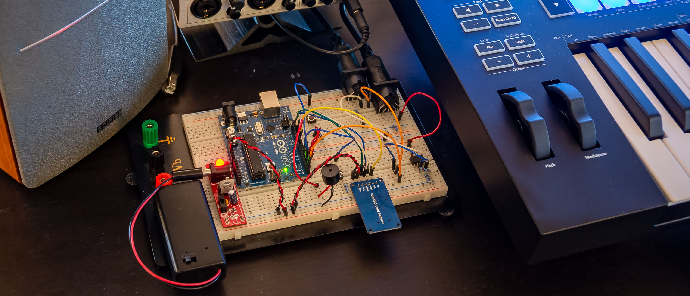
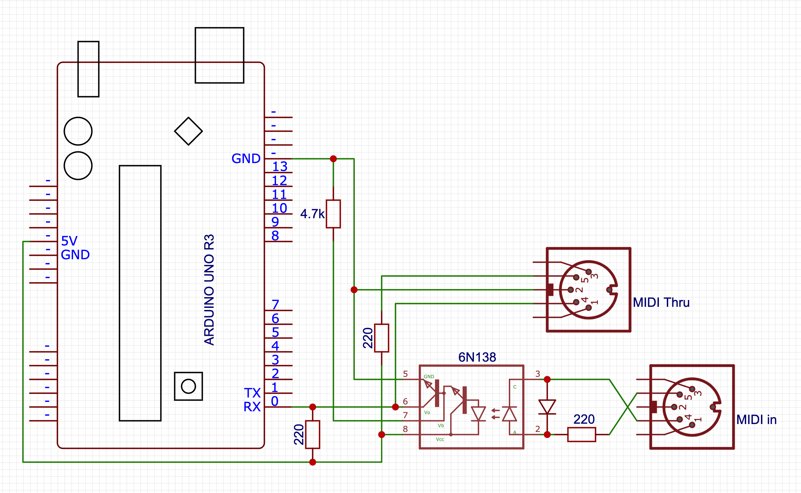

<meta name="twitter:card" content="summary_large_image">
<meta name="twitter:title" content="Building an Arduino MIDI recorder">
<meta name="twitter:description" content="Let's build an Arduino-based MIDI recorder, for fun and non-profit!">
<meta name="twitter:image" content="https://pomax.github.io/arduino-midi-recorder/banner.jpg">
<meta property="og:title" content="Building an Arduino MIDI recorder">
<meta property="og:description" content="Let's build an Arduino-based MIDI recorder, for fun and non-profit!">
<meta property="og:image" content="https://pomax.github.io/arduino-midi-recorder/banner.jpg">
<meta property="og:site_name" content="pomax.github.io">
<meta property="og:url" content="https://pomax.github.io/arduino-midi-controller">
<meta itemprop="url" content="https://pomax.github.io/arduino-midi-controller">
<meta itemprop="name" content="pomax.github.io">
<meta itemprop="description" content="Let's build an Arduino-based MIDI recorder, for fun and non-profit!">
<meta itemprop="image" content="https://pomax.github.io/arduino-midi-recorder/banner.jpg">

# Creating a MIDI pass-through recorder

If you've ever used audio softare on the computer, you probably know that MIDI exists: a signalling protocol that allows controllers to control vitual instruments like synths. It's also the protocol used by real audio hardware to talk to each, and you can think of it as the language in which devices talk about what they're doing, rather than what audio they're generating.

As such, there are two ways to record instruments (real or virtual): record the sound they're making, or record the MIDI event that cause that sound to be made, and that's where things get interesting.

There are many, _many_ ways to record audio, from microphones to line monitors to audio interfaces, but not all that many ways to record MIDI events. Essentially: unless you're running software that monitors MIDI events, there isn't really any way to record MIDI. So I set out to change that: in the same way that you can just hook up an audio field recorder (like a Tuscan DR-05) to sit between an audio-out on something that generates audio and an audio-in on something that should be listening to that audio, writing that to an SD card as `.wav` or `.mp3` or the like,  I built a MIDI "field recorder" that you plug in between your MIDI-out and some MIDI-in, indiscriminately recording every MIDI event that gets sent over the wire to an SD card as a `.mid` file.

You'd think this would be something that already exists as a product you can just buy. Amazingly, it is not. So if you want one too, you'll have to build one, and if you want to build one, this post might be useful to you!

## Table of contents

1. [The circuitry](#the-circuitry)
   1. [MIDI](#the-midi-part-of-our-recorder)
   1. [SD card](#the-sd-part-of-our-recorder)
   1. [All the beeps](#adding-a-beep-for-debugging)
1. [The software](#the-software)
   1. [Basics](#program-basics)
   1. [MIDI handling](#midi-handling)
   1. [File management](#file-management)
   1. [Making some beeps](#making-some-beeps)
   1. [idle handling](#creating-a-new-file-when-idling)
1. [Comments/questions](#comments-and-or-questions)

## The circuitry

<a href="banner.jpg" target="_blank"></a>

To build this, we're going to basically build a standard Arduino based MIDI pass-through, with an SD card circuit hooked up so we can save the data that comes flying by. To build everything, we'll need some special components:

1. An Arduino SD card module (~$10 for a pack of five)
1. Two female 5-pin DIN connectors (~$5 for a pack of ten)
1. A 6N138 optocoupler (~$10 for a pack of ten)

And of course, the bits that you'll get with pretty much any Arduino starter kit:

1. An Arduino UNO R3 or equivalent board
1. 3x 220 ohm resistors
1. 1x 4.7k ohm resistor
1. A diode
1. A piezo buzzer
1. A clicky pushy button

### The MIDI part of our recorder

We set up MIDI-In on the Arduino `RX<-0` pin, with MIDI-Thru tapping straight into signal that's getting sent to `RX<-0`, too. The only tricky bit about this is that MIDI signals are isolated from the rest of the circuitry via an optocoupler (which gets around ground loop problems by literally transmitting signals by running them through a LED, which emits the signal as light, which then gets picked up by another LED and turned back into signal).



(I know, "Thru isn't a word!", but that's what [the MIDI spec](http://www.shclemen.com/download/The%20Complete%20MIDI1.0%20Detailed%20Spec.pdf#page=7&zoom=auto,-206,478) calls it, so English gets to take a back seat here...)

### The SD part of our recorder

The SD card circuitry is literally just a matter of "connect the pins to the pins", with the only oddity being that the pins don't _quite_ line up well enough to literally just stick the SD card module directly into the Arduino.

However, note that your SD card module **may have a different pin layout** so be sure to double-check before wiring things up!


### Adding a beep, for debugging

Also, we're going to add a little piezo speaker and a button that we can press to turn on (or off) playing a note corresponding to a MIDI note getting played, mostly as the audio equivalent of visual debugging. There's barely any work here: we hook up the "speaker" between pin 8 and ground, and the button to pin 2. Beep, beep!


## The Software

With the circuitry set up, let's start writing our program, focussing on dealing with each circuit in its own section

1. program basics
1. basic signal handling (MIDI library)
1. basic file writing (SD library)
1. Audio debugging (beep beep)
1. Usability bonus: "clean restart" on idle

### Program basics

Our basic program will need to import the standard [SD](https://www.arduino.cc/en/reference/SD) library, as well as the [MIDI](https://github.com/FortySevenEffects/arduino_midi_library) library (which you'll probably need to [install first](https://github.com/FortySevenEffects/arduino_midi_library#getting-started)).

Note that if you don't want to "follow along" and instead you just want the code, you can copy-paste the code found over in [midi-recorder.ino](https://raw.githubusercontent.com/Pomax/arduino-midi-recorder/master/midi-recorder.ino) into the Arduino IDE.

```c++
#include <SD.h>
#include <MIDI.h>

MIDI_CREATE_DEFAULT_INSTANCE();

void setup() {
  // we'll put some more code here in the next sections
}

void loop() {
  // we'll put some more code here in the next sections
}
```

And we're done!

Of course this doesn't _do_ anything yet, so let's add the rest of the code, too.

### MIDI handling

For our MIDI handling, we'll need to set up listeners for MIDI events, and make sure to poll for that data during the program loop:

```c++
void setup() {
  MIDI.begin(MIDI_CHANNEL_OMNI);
  MIDI.setHandleNoteOn(handleNoteOn);
  MIDI.setHandleNoteOff(handleNoteOff);
  MIDI.setHandlePitchBend(handlePitchBend);
  MIDI.setHandleControlChange(handleControlChange);
}

void loop() {
  MIDI.read();
}
```

This sets up MIDI listening on all MIDI channels (there are sixteen of them, and we don't want to guess which channels are active), and reads out the MIDI data from `RX<-0` - you may have noticed we don't explicitly set a baud rate: the MIDI spec only allows for 31,250 bits per second, so the Arduino MIDI library automatically makes sure to set the correct polling rate for us.

That leaves implementing our MIDI event handling:

```c++
#define NOTE_OFF_EVENT 0x80
#define NOTE_ON_EVENT 0x90
#define CONTROL_CHANGE_EVENT 0xB0
#define PITCH_BEND_EVENT 0xE0

void handleNoteOff(byte CHANNEL, byte pitch, byte velocity) {
  byte eventTypeOnChannel = NOTE_OFF_EVENT | CHANNEL;
  writeToFile(eventTypeOnChannel, pitch, velocity);
}

void handleNoteOn(byte CHANNEL, byte pitch, byte velocity) {
  byte eventTypeOnChannel = NOTE_ON_EVENT | CHANNEL;
  writeToFile(eventTypeOnChannel, pitch, velocity);
}

void handleControlChange(byte CHANNEL, byte controller, byte value) {
  byte eventTypeOnChannel = CONTROL_CHANGE_EVENT | CHANNEL;
  writeToFile(eventTypeOnChannel, controller, value);
}

void handlePitchBend(byte CHANNEL, int bend_value) {
  byte eventTypeOnChannel = PITCH_BEND_EVENT | CHANNEL;

  // Per the MIDI spec, bend_value is 14 bits, and needs
  // to be encoded as two 7-bit bytes, encoded as the
  // lowest 7 bits in the first byte, and the highest 7
  // bits in the second byte:
  byte low7bits = (byte) (bend_value & 0x7F);
  byte high7bits = (byte) ((bend_value >> 7) & 0x7F);

  writeToFile(eventTypeOnChannel, low7bits, high7bits);
}
```

This is a good start, but MIDI events are just that: events, and events happen "at some specific time" which we're still going to have to capture. MIDI events don't rely on absolute time based on some kind of real time clock (which is good for us, because Arduino doesn't have an RTC built in!) and instead relies on counting a "time delta": it marks events with the number of "MIDI clock ticks" since the previous event, with the very first event in the event stream having an explicit time delta of zero.

So: let's write a `getTmeDelta()` function that we can use to get the number of MIDI ticks since the last event (=since the last time `getTmeDelta()` got called) so that we have all the data we need ready to start writing MIDI to file:

```c++
unsigned long startTime = 0;
unsigned long lastTime = 0;
unsigned int timeDelta = 0;

int getTmeDelta() {
  if (startTime == 0) {
    startTime = micros();
    lastTime = startTime;
    return 0;
  }
  timeDelta = (micros() - lastTime) / 100;
  lastTime += timeDelta ;
  return timeDelta;
}
```

This function seems bigger than it has to be: we _could_ just start the clock when our sketch starts, setting `lastTime=micros()` in `setup()`, and then in `getTmeDelta` only have the `timeDelta` calculation and `lastTime` update, but that would be explicitly encoding "a lot of nothing" at the start of our MIDI file: we'd be counting the ticks for the first event relative to starting the program, rather than treating the first event as starting at tick zero. So instead, we explicitly encode the time that the first event happens as `startTime` and then we start delta calculation relative to that, instead.

You may also have noticed that we're (a) using `micros()` instead of the more common `millis()`, and (b) we're not even using that value directly, we're scaling it so that our ticks are 1/10,000th of a second instead. The reason here is that the MIDI spec links "the number of ticks per quaver/quarter note" and "the time it takes to play a quaver/quarter note" based on microseconds: in our case, we'll be defining a quaver/quarter note as taking 390,000μs, spanning an interval of 4000 ticks. So, in order to make sure there's we're using the correct scale for the number of ticks, we'll need to divide `micros()` by 100.

That then leaves updating our handlers:

```c++
void handleNoteOn(byte CHANNEL, byte pitch, byte velocity) {
  ...
  writeToFile(..., getTmeDelta());
}

void handleNoteOff(byte CHANNEL, byte pitch, byte velocity) {
  ...
  writeToFile(..., getTmeDelta());
}

void handleControlChange(byte CHANNEL, byte controller_code, byte value) {
  ...
  writeToFile(..., getTmeDelta());
}

void handlePitchBend(byte CHANNEL, int bend_value) {
  ...
  writeToFile(..., getTmeDelta());
}
```

Which means we can move on to actually writing MIDI data to a `.mid` file!

### File management

The `SD` library makes working with SD cards super easy, but of course we're still going to have to write all the code for creating file handles, and writing binary data into them. So first, some setup:

```c++
#define CHIP_SELECT 9

String filename;
File file;

void setup() {
  pinMode(CHIP_SELECT, OUTPUT);

  if (SD.begin(CHIP_SELECT)) {
    findNextFilename();
    if (file) {
      createMidiFile();
    }
  }
}

void findNextFilename() {
  for (int i = 1; i < 1000; i++) {
    filename = "file-";
    if (i < 10) filename += "0";
    if (i < 100) filename += "0";
    filename += String(i);
    filename += String(".mid");

    if (!SD.exists(filename)) {
      file = SD.open(filename, FILE_WRITE);
      return;
    }
  }
}
```

Our initial setup is fairly straight forward: we tell the `SD` library that we'll be communicating to the SD card using pin 9, and then we try to create a new file to write to. There's a nuber of ways of which we can do this, but the simplest is "build a filename, see if it exists, if it doesn't: use that filename". In this case, we create a fliename with pattern `file-xxx.mid` where `xxx` ranges from `001` to `999` and we simply pick the first available filename. Another way to do this would be to use the Arduino's EEPROM to store a value so that we get a guaranteed new value each time the Arduino starts up, that would also mean that if we wipe the SD card and turn the Arduino on, we wouldn't start at `001` but some random nubmer, and frankly that's silly.

So: while this is _also_ silly, it's less silly and we're rolling with it.

Next, when we have a filename that works we open the file in `FILE_WRITE` mode, which --perhaps counter-intuitively-- means we'll be opening the file in `APPEND` mode: we have read/write access, but the file point is "stuck" at the end of the file and any data we write gets appended to what's already there. For MIDI files, which are essentially streams of events, that's exactly what we need, so we move on: we need to write a bit of boilerplate data into our new file, after which we can start dealing with recording actual MIDI events that we see flying by in the MIDI handlers we wrote in the previous section.

```c++
void createMidiFile() {
  byte header[] = {
    0x4D, 0x54, 0x68, 0x64,   // "MThd" chunk
    0x00, 0x00, 0x00, 0x06,   // chunk length (from this point on): 6 bytes
    0x00, 0x00,               // format: 0
    0x00, 0x01,               // number of tracks: 1
    0x0F, 0xA0                // data rate: 4000 ticks per quaver/quarter note
  };
  file.write(header, 14);

  byte track[] = {
    0x4D, 0x54, 0x72, 0x6B,   // "MTrk" chunk
    0x00, 0x00, 0x00, 0x00    // chunk length placeholder
  };
  file.write(track, 8);

  byte tempo[] = {
    0x00,                     // time delta for the first MIDI event: zero
    0xFF, 0x51, 0x03,         // MIDI event type: "tempo" instruction
    0x05, 0xF3, 0x70          // tempo value: 390,000μs per quaver/quarter note
  };
  file.write(tempo, 7);

  file.flush();
}
```

Rather than explaining why we need this data, I will direct you to [The MIDI File Format](http://www.music.mcgill.ca/~ich/classes/mumt306/StandardMIDIfileformat.html) specification, but the short version is that this is all boiler plate bytecode if we want a single event stream MIDI file, with two custom values:

1. we get to choose the data rate in the header, and we went with 4000 ticks per quaver/quarter note, and
2. we also get to choose the "play speed", which we set a little under half a second per quaver/quarter note.

You may also notice that we've set the track length to zero: normally this value gets set to the byte length of the track when you save a `.mid` file on, say, your computer, but we don't know what that length is yet. In fact, we're never going to make our code figure that out: we'll write a small [Python](https://python.org) script to help set that value only when it's important (e.g. when you're ready to import the data into whatever audio application you have that you want to load MIDI data into).

And with that, it's time to get to the entire reason you're reading along: the code that writes incoming MIDI signals to our file: let's implement `writeToFile`:

```c++
void writeToFile(byte eventType, byte b1, byte b2, int delta) {
  if (!file) return;
  writeVarLen(delta);
  file.write(eventType);
  file.write(b1);
  file.write(b2);
}
```

That's... that's not a lot of code. And the reason it's not a lot of code is that MIDI was intended to be super small both to send and to read/write. The only tricy part is the `writeVarLen()` function, which turns integers into their corresponding byte sequences. Thankfully, the MIDI spec handily provides the code necessary to achieve this, so we simply adopt that for our Arduino program and we're good to go:

```c++
#define HAS_MORE_BYTES 0x80

void writeVarLen(unsigned long value) {
  unsigned long buffer = value & 0x7f;

  while ((value >>= 7) > 0) {
    buffer <<= 8;
    buffer |= HAS_MORE_BYTES;
    buffer |= value & 0x7f;
  }

  while (true) {
    file.write((byte)(buffer & 0xff));
    if (buffer & HAS_MORE_BYTES) {
      buffer >>= 8;
    } else {
      break;
    }
  }
}
```

This allocates 4 bytes and then copies the input value in 7-bit chunks for each byte, with the byte's highest bit set to `0` if there's going to be another byte, or `1` if this is the last byte. This turns the input value into a buffer that has MSBF-ordered bits-per-byte, but LSBF-ordered bytes-per-buffer. The `while(true)` then writes those bytes to file in reverse, so they end up MSBF-ordered in the file. Nothing fancy, but just fancy enough to be fast.

### Making some beeps

With MIDI handling and file writing taken care of, one thing that's just a nice-to-have is being able to confirm that your MIDI event handling works, for which we're going to use our "speaker" and button for. First, we set up the code that lets us decide whether to beep, or not to beep:

```c++
#define AUDIO_DEBUG_PIN 2

int lastPlayState = 0;
bool play = false;

void setup() {
  pinMode(AUDIO_DEBUG_PIN, INPUT);
}

void loop() {
  setPlayState();
}

void setPlayState() {
  int signal = digitalRead(AUDIO_DEBUG_PIN);
  if (signal != lastPlayState) {
    lastPlayState = signal;
    if (signal == 1) play = !play;
  }
}
```

The only special thing that's going on here is that when we press our button, we want that the program to know that it can now play audio (or not), so we track whether we should make sound with the `play` boolean, and then during the program loop we check to see if there's a signal coming from our button. If there is, then we're pressing it, and we check whether we were previously _not_ pressing it. If that's true, we can toggle our `play` state. The reason we do this, rather than just toggling `play` when there's _any_ signal on our button, is that we _only_ want to toggle when the button goes down, not when you're hodling it down. If we did that, the `play` state would be flip-flopping between true and false every time `loop()` runs (32 thousand times a second!) for as long as you hold the button down. That'd be super weird!

With that part covered, let's add some beeps so that when we press a key on our MIDI device, we hear the corresponding note in all its pristine, high quality piezo-buzz audio:

```c++
void handleNoteOn(byte CHANNEL, byte pitch, byte velocity) {
  writeToFile(NOTE_ON_EVENT | CHANNEL, pitch, velocity, getTmeDelta());
  if (play) tone(AUDIO, 440 * pow(2, (pitch - 69.0) / 12.0), 100);
}
```

Again, very little code, with the only surprise probably being that second argument for `tone()`: MIDI notes, while they claim to send a `pitch` value, actually send a pitch _identifier_, so rather than some audio frequency they say which "piano key" is active. To turn that into the corresponding audio frequency, we need to establish a few things:

1. what kind of tuning system we want to use, and
2. what the base frequency for A over middle C is.

To keep things simple, because we're only writing this code for some debugging (and maybe fun), we'll use the standard [twelve tone equal temperament](https://en.wikipedia.org/wiki/12_equal_temperament) tuning, where every 12 note step doubles the audible frequency, with equal logarithmic steps from note to note, and a base frequency for A over middle C of [440 Herz](https://en.wikipedia.org/wiki/A440_(pitch_standard)). Of course, because there are _plenty_ of notes below A over middle C, we need to correct our pitch identifier for the MIDI pitch value for that key, which is 69, and so that gives us the formula:

```
                             (MIDI pitch - 69) / 12
  frequency in Herz = 440 * 2

```

So now if we start our program, and we press our button, playing notes on our MIDI device will make the Arduino beep along with what we're playing. Of course, the `tone()` function can only play a single note at a time, so it's going to sound wonky if we play chords, but it'll beeping as best as it can.

Beep, beep!

### Creating a new file when idling

Finally, the whole point of this recorder is to record MIDI... not to record an hour of silence because you stopped playing and  went off to do something else for a bit. To that end, what we would like is for our program to detect that you've _not_ been playing anything for a while (say, a few minutes) and then stop recording, starting recording on a new file when you _do_ start playing again.

As it so happens, the first part is _constantly_ true, because we're only writing to our file when new data comes in, and we've _also_ already implemented the second part: that happens automatically when you turn on the Arduino, so the only thing we're missing is a way to detect whether there's not been any input for a while:

```c++
#define RECORDING_TIMEOUT 120000000
// 2 minutes, counted in microseconds

unsigned long lastLoopCounter = 0;
unsigned long loopCounter = 0;

void loop() {
  loopCounter = millis();
  if (loopCounter - lastLoopCounter > 400) {
    checkReset();
    lastLoopCounter = loopCounter;
    file.flush();
  }
}

void checkReset() {
  if (!file) return;
  if (micros() - lastTime > RECORDING_TIMEOUT) {
    file.close();
    if (startTime == 0) SD.remove(filename);
    reset_arduino();
  }
}

void(* reset_arduino) (void) = 0;
```

That might do more than you thought, so let's look at what's happening.

First, we want to check whether any MIDI activity has happened during the program loop, but we _don't_ want to check that 32,150 times each second. So, instead, we set up some standard code to check every 400 milliseconds, where we check whether the difference between the `lastTime` (which is the microsecond timestamp for the last MIDI event) and the current `micros()` value is more than 2 minutes, counted in microseconds. If it is, then we're just idling and we can restart the Arduino to start a new file. However, we don't want to create a million (or, hundreds, since we only allow 999 files in this program) files that are all 29 bytes long because they contain the boilerplate MIDI code but nothing else, so if the Arduino has been idling _without_ any MIDI event having been seen yet, we delete the currently open file first, so that when the Arduino restarts, it will create "the same file" and it'll be as if we've hit rewind on the current file, rather than having restarted.

Also note that we're closing our file before we reset: as long as our file handle is open, the actual on-disk state is _unknown_ and it's entirely possible for our SD card to show a 0 byte file, so we want to explicitly close the file handle before we reset. This is also why you're seeing that `file.flush()`, which runs (without closing the file) if we're not resetting: we want to make sure that the on-disk file is kept reasonably in sync with the data we've been recording, keeping the SD controller's file buffer nice and small.

Finally, there's the `reset_arduino()` "function". This doesn't look like any function you've seen, and is really not so much a normal function as an exploit of the Arduino chipset's watchdog: we're intentionally doing something illegal, which causes the Arduino to reset! There are a million ways to make C++ code do something illegal, but in this case we're defining a function pointer that tries to execute whatever's in memory address 0. That's _incredibly wrong_ and so when we execute that call, the Arduino goes "WHAT? NO!" and reboots. It's delightfully effective.

## And we're done

That's it, all that reminds is to assemble the circuits, and put all the code toghether, and you have yourself an Arduino MIDI recorder! Thanks for reading along, and if you put this together and put it to good use, shoot me a message! I love hearing from folks who put what I make to good use (or _bad_!) use =D

## Comments and/or questions

Hit up [the issue tracker](https://github.com/Pomax/arduino-midi-recorder/issues) if you want to have a detailed conversation, or just tweet/toot at me on [Twitter](https://twitter.com/TheRealPomax) or [Mastodon](https://mastodon.social/@TheRealPomax) if you want the kind of momentary engagement the internet seems to be for these days =)

— Pomax
